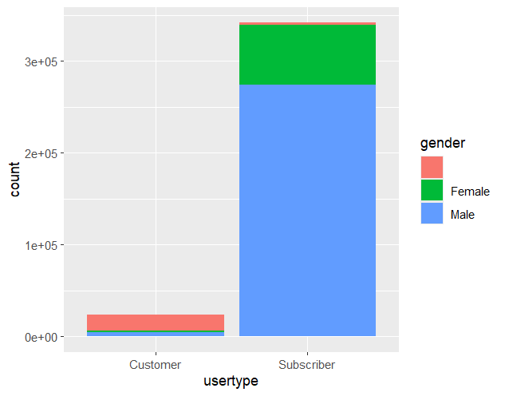
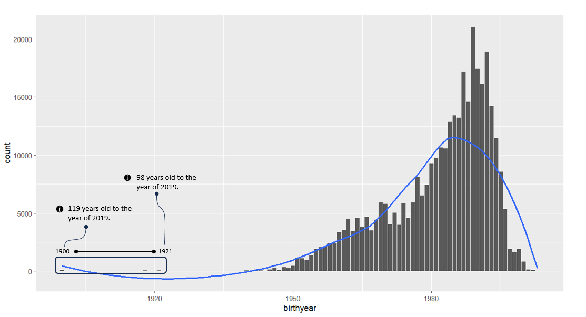

# Dataset - Divvy_Trips_2019_Q1
This dataset contains trip data about first quarter of 2019.

1. Identified null values
        
    - Used R (Programming lang.) to load and inspect the dataset.
        ```r
        library(tidyverse)
        data <- read.csv("./csv/divvy_trips_2019_Q1.csv")
        ```
    - Checked for missing values with following code
        ```r
        null_values <- sapply(data, function(x) sum(is.na(x) | x == ""))
        null_values
        ```
        ```perl
         gender         birthyear 
         19711             18023
        ```
    - Identified null values in the "gender" and "birthyear" feilds (there are 365069 total rows):

        |feild | null_val | % |
        |------|----------|---|
        |gender|19711     |5.4%|
        |birthyear|18023  |4.9%|

2. Visualization of null values in `gender` feild:
    - summarized gender distribution by usertype:
        ```r
        data %>% ggplot (aes(x = usertype, fill = gender)) + geom_bar()
        ```
        

        ```r
        data %>% group_by(usertype, gender) %>% summarize(count = n(), per = n() / nrow(.) * 100)
        ```
        ```perl
          usertype   gender    count    per
          <chr>      <chr>     <int>  <dbl>
        1 Customer   ""        17228  4.72 
        2 Customer   "Female"   1875  0.514
        3 Customer   "Male"     4060  1.11 
        4 Subscriber ""         2483  0.680
        5 Subscriber "Female"  65043 17.8  
        6 Subscriber "Male"   274380 75.2 
        ```
        Zoom in "Customer" user type (casual riders):
        ```r
        data %>% group_by(usertype, gender) %>% filter(usertype == "Customer") %>% summarize(count = n(), per = n() / nrow(.) * 100)
        ```
        ```perl
          usertype gender   count   per
          <chr>    <chr>    <int> <dbl>
        1 Customer ""       17228 74.4 
        2 Customer "Female"  1875  8.09
        3 Customer "Male"    4060 17.5 
        ```

3. Handeling null values in `gender` feild.
    - Due to the high percentage of null values for casual riders, deleting those rows could lead to a loss of valuable data.
    - Insted considered: filling missing values with a placeholder value. ("Unknown")
      ```r
      data <- data %>% mutate(gender = ifelse(gender == "", "unknown", gender))
      ```

4. Visualizing values in `birthyear` feild.
    - Identified out of range value on birthyear feild.
      ```r
      summary_birthyr <- data %>% group_by(birthyear) %>% summarize(count = n())

      summary_birthyr %>% ggplot(aes(x = birthyear, y = count)) + geom_col() + geom_smooth(mehtod = "loess", se = FALSE)
      ```
      **Birth year disbribution of each ride**:
      
    - Analyzed further with converting birthyer to age, for broad understanding.
      ```r
      data <- data %>% mutate(age = 2019 - as.numeric(birthyear))
      ggplot(data, aes(x = age, fill = usertype)) + geom_histogram(binwidth = 5, position = "dodge") +  labs(title = "Age Distribution by User Type", x = "Age", y = "Count")

      summary(data$age)
      ```
      ```
       Min. 1st Qu.  Median    Mean 3rd Qu.    Max.    NA's 
      16.00   29.00   34.00   37.33   44.00  119.00   18023 
      ```

5. Reassign unreasonable ages to NA.
    - To maintain data intergrity of the dataset unreliable age data converted into null values.
      ```r
      data <- data %>% mutate(birthyear = ifelse(age > 100 | age < 10, NA, birthyear), age = ifelse(age > 100 | age < 10, NA, age))
      ```
    - efected rows: 
6. Handeling null values in `birthyear` feild.
    - Desided to keep null values in birthyear feild as they are. 
    - Considered filling null values with the median value, but it could lead to increse the count for the median birthyear. filling null values with a random birthyear could lead to inaccurate data. Deleting records with null values could lead to loss other valueble data.
    - limitations: 

7. Checking for duplicates.
    - Checked duplicates with following code. And there was no duplicates
      ```r
      data[duplicated(data), ]
      ```
      ```
      <0 rows> (or 0-length row.names)
      ```
      Filter non duplicate data:
      ```r
      data <- data[!duplicated(data), ]
      ```
    - 0 rows effected with above code.

8. Verify data types.
    - Ensure `start_time` and `end_time` in correct format:
      ```r
      data <- data %>%
      mutate(
        start_time = as.POSIXct(start_time, format = "%Y-%m-%d %H:%M:%S"),
        end_time = as.POSIXct(end_time, format = "%Y-%m-%d %H:%M:%S")
      )
      ```
    - Identified `tripduration` is not in the correct format:

      ```r
      summary(data$tripduration)
      ```
      ```
       Length     Class      Mode 
        365069 character character 
      ```
    - Before resolving `tripduration`, verified that `start_time` is less than `end_time`
      ```r
      data %>% filter(end_time <= start_time) %>% summarize(rows = nrow(.))
      ```
    - mutate trip durarion:
      ```r
      data <- data %>%
      mutate(
        tripduration = as.numeric(difftime(end_time, start_time, units = "secs")),
        tripduration = sprintf("%02d:%02d:%02d", tripduration %/% 3600, (tripduration %% 3600) %/% 60, tripduration %% 60)
      )
      ```

9. checking and cleaning station IDs and names.
    - Inspect unique stations IDs and names
      ```r
      unique_from_stations <- data %>% select(from_station_id, from_station_name) %>% distinct()
      unique_to_stations <- data %>% select(to_station_id, to_station_name) %>% distinct()
      unique_to_stations <- unique_to_stations %>% rename(from_station_id = to_station_id,from_station_name = to_station_name)
      unique_stations <- bind_rows(unique_from_stations, unique_to_stations)
      unique_stations <- unique_to_stations %>% rename(station_id = from_station_id,station_name = from_station_name)
      ```
    - check duplicates in unique values:
      ```r
      unique_stations[duplicated(unique_stations$station_id), ]
      unique_stations[duplicated(unique_stations$station_name), ]
      ```
10. Investigate `usertype`
    - check unique values and distribution of usertype
      ```r
      unique(data$usertype)
      data %>% group_by(usertype) %>% summarize(row_count = n(), per = n() / nrow(.) * 100)
      ```
      ```
        usertype   row_count   per
        <chr>          <int> <dbl>
      1 Customer       23163  6.34
      2 Subscriber    341906 93.7 
      ```

11. Save the cleaned data:
    ```r
    write.csv(data, "./cleaned/divvy_trips_2019_Q1.csv", row.names = FALSE)
    rm(data, unique_from_stations, unique_to_stations, unique_stations)
    ```
summarized code:
```r
library(tidyverse)
data <- read.csv("./csv/divvy_trips_2019_Q1.csv")

# have a placeholder to null values
data <- data %>% mutate(gender = ifelse(gender == "", "unknown", gender))

#clean unresonable birthyear data
data <- data %>% mutate(age = 2019 - as.numeric(birthyear))
data <- data %>% mutate(birthyear = ifelse(age > 100 | age < 10, NA, birthyear), age = ifelse(age > 100 | age < 10, NA, age))

#change data type of start_time and end_time
data <- data %>%
mutate(
  start_time = as.POSIXct(start_time, format = "%Y-%m-%d %H:%M:%S"),
  end_time = as.POSIXct(end_time, format = "%Y-%m-%d %H:%M:%S")
)

#mutate trip duration
data <- data %>%
mutate(
  tripduration = as.numeric(difftime(end_time, start_time, units = "secs")),
  tripduration = sprintf("%02d:%02d:%02d", tripduration %/% 3600, (tripduration %% 3600) %/% 60, tripduration %% 60)
)

#check null values on station_names and IDs
unique_from_stations <- data %>% select(from_station_id, from_station_name) %>% distinct()
unique_to_stations <- data %>% select(to_station_id, to_station_name) %>% distinct()
unique_to_stations <- unique_to_stations %>% rename(from_station_id = to_station_id,from_station_name = to_station_name)
unique_stations <- bind_rows(unique_from_stations, unique_to_stations) 
unique_stations <- unique_to_stations %>% rename(station_id = from_station_id,station_name = from_station_name)

unique_stations[duplicated(unique_stations$station_id), ]
unique_stations[duplicated(unique_stations$station_name), ]
```

# Dataset - Divvy_Trips_2019_Q2
This dataset contains trip data about second quarter of 2019.

1. Changed the col names for data intergrity.
        
    - Used R (Programming lang.) to load and inspect the dataset.
        ```r
        library(tidyverse)
        data <- read.csv("./csv/divvy_trips_2019_Q2.csv")
        #check col names
        colnames(data)
        ```
    - Changed the col names.
        ```r
        data <- data %>% rename(trip_id = X01...Rental.Details.Rental.ID, start_time = X01...Rental.Details.Local.Start.Time, end_time = X01...Rental.Details.Local.End.Time, bike_id = X01...Rental.Details.Bike.ID, tripduration = X01...Rental.Details.Duration.In.Seconds.Uncapped, from_station_id = X03...Rental.Start.Station.ID, from_station_name = X03...Rental.Start.Station.Name, to_station_id = X02...Rental.End.Station.ID, to_station_name = X02...Rental.End.Station.Name, usertype = User.Type, gender = Member.Gender, birthyear = X05...Member.Details.Member.Birthday.Year)

        #check the col names back
        colnames(data)
        ```
2. Check for null values:
      - ran followoing code to check null values:
        ```r
        null_values <- sapply(data, function(x) sum(is.na(x) | x == ""))
        null_values
        ```
        ```perl
         gender         birthyear 
         185554             180953
        ```
    - Identified null values in the "gender" and "birthyear" feilds (there are 365069 total rows):

        |feild | null_val | % |
        |------|----------|---|
        |gender|185554     |16.74429%|
        |birthyear|180953  |16.3291%|
3. Handeling null values in `gender` feild:
    
    Note: it's very similr to previous file. (ref: divvy_trips_ 2019_Q1)
    - filling missing values with a placeholder value. ("Unknown")
      ```r
      data <- data %>% mutate(gender = ifelse(gender == "", "unknown", gender))
      ```
4. Handeling null and unresonable values in `birthyear` feild.
    - derive age from birthyear and then reasign NA for unresonable values:
      ```r
      data <- data %>% mutate(age = 2019 - as.numeric(birthyear))
      data <- data %>% mutate(birthyear = ifelse(age > 100 | age < 10, NA, birthyear), age = ifelse(age > 100 | age < 10, NA, age))
      ```
    - 115 rows effected.
5. Checking for duplicates:
    - Checked duplicates on primary key:
      ```r
      data[duplicated(data$trip_id), ]
      ```
8. Verify data types.
    - Ensure `start_time` and `end_time` in correct format:
      ```r
      data <- data %>%
      mutate(
        start_time = as.POSIXct(start_time, format = "%Y-%m-%d %H:%M:%S"),
        end_time = as.POSIXct(end_time, format = "%Y-%m-%d %H:%M:%S")
      )
      ```
    - Identified `tripduration` is not in the correct format:

      ```r
      summary(data$tripduration)
      ```
      ```
       Length     Class      Mode 
        365069 character character 
      ```
    - Before resolving `tripduration`, verified that `start_time` is less than `end_time`
      ```r
      data %>% filter(end_time <= start_time) %>% summarize(rows = nrow(.))
      ```
    - mutate trip durarion:
      ```r
      data <- data %>%
      mutate(
        tripduration = as.numeric(difftime(end_time, start_time, units = "secs")),
        tripduration = sprintf("%02d:%02d:%02d", tripduration %/% 3600, (tripduration %% 3600) %/% 60, tripduration %% 60)
      )
      ```
7. checking and cleaning station IDs and names.
    - Inspect unique stations IDs and names
      ```r
      unique_from_stations <- data %>% select(from_station_id, from_station_name) %>% distinct()
      unique_to_stations <- data %>% select(to_station_id, to_station_name) %>% distinct()
      unique_to_stations <- unique_to_stations %>% rename(from_station_id = to_station_id,from_station_name = to_station_name)
      unique_stations <- bind_rows(unique_from_stations, unique_to_stations)
      unique_stations <- unique_to_stations %>% rename(station_id = from_station_id,station_name = from_station_name)
      ```
    - check duplicates in unique values:
      ```r
      unique_stations[duplicated(unique_stations$station_id), ]
      unique_stations[duplicated(unique_stations$station_name), ]
      ```
8. Investigate `usertype`
    - check unique values and distribution of usertype
      ```r
      unique(data$usertype)
      data %>% group_by(usertype) %>% summarize(row_count = n(), per = n() / nrow(.) * 100)
      ```

9. Save the cleaned data:
    ```r
    write.csv(data, "./cleaned/divvy_trips_2019_Q2.csv", row.names = FALSE)
    rm(data, unique_from_stations, unique_to_stations, unique_stations)
    ```
summarized code:
```r
library(tidyverse)
data <- read.csv("./csv/divvy_trips_2019_Q2.csv")

# change the col names
data <- data %>% rename(trip_id = X01...Rental.Details.Rental.ID, start_time = X01...Rental.Details.Local.Start.Time, end_time = X01...Rental.Details.Local.End.Time, bike_id = X01...Rental.Details.Bike.ID, tripduration = X01...Rental.Details.Duration.In.Seconds.Uncapped, from_station_id = X03...Rental.Start.Station.ID, from_station_name = X03...Rental.Start.Station.Name, to_station_id = X02...Rental.End.Station.ID, to_station_name = X02...Rental.End.Station.Name, usertype = User.Type, gender = Member.Gender, birthyear = X05...Member.Details.Member.Birthday.Year)

# have a placeholder to null values
data <- data %>% mutate(gender = ifelse(gender == "", "unknown", gender))

#clean unresonable birthyear data
data <- data %>% mutate(age = 2019 - as.numeric(birthyear))
data <- data %>% mutate(birthyear = ifelse(age > 100 | age < 10, NA, birthyear), age = ifelse(age > 100 | age < 10, NA, age))

#change data type of start_time and end_time
data <- data %>%
mutate(
  start_time = as.POSIXct(start_time, format = "%Y-%m-%d %H:%M:%S"),
  end_time = as.POSIXct(end_time, format = "%Y-%m-%d %H:%M:%S")
)

#mutate trip duration
data <- data %>%
mutate(
  tripduration = as.numeric(difftime(end_time, start_time, units = "secs")),
  tripduration = sprintf("%02d:%02d:%02d", tripduration %/% 3600, (tripduration %% 3600) %/% 60, tripduration %% 60)
)

#check null values on station_names and IDs
unique_from_stations <- data %>% select(from_station_id, from_station_name) %>% distinct()
unique_to_stations <- data %>% select(to_station_id, to_station_name) %>% distinct()
unique_to_stations <- unique_to_stations %>% rename(from_station_id = to_station_id,from_station_name = to_station_name)
unique_stations <- bind_rows(unique_from_stations, unique_to_stations) 
unique_stations <- unique_to_stations %>% rename(station_id = from_station_id,station_name = from_station_name)

unique_stations[duplicated(unique_stations$station_id), ]
unique_stations[duplicated(unique_stations$station_name), ]
```

# Dataset - Divvy_Trips_2019_Q3
This dataset contains trip data about third quarter of 2019.

summarized code:
```r
library(tidyverse)
data <- read.csv("./csv/divvy_trips_2019_Q3.csv")

# change the col names
data <- data %>% rename(bike_id = bikeid)

# have a placeholder to null values
data <- data %>% mutate(gender = ifelse(gender == "", "unknown", gender))

#clean unresonable birthyear data
data <- data %>% mutate(age = 2019 - as.numeric(birthyear))
data <- data %>% mutate(birthyear = ifelse(age > 100 | age < 10, NA, birthyear), age = ifelse(age > 100 | age < 10, NA, age))

#change data type of start_time and end_time
data <- data %>%
mutate(
  start_time = as.POSIXct(start_time, format = "%Y-%m-%d %H:%M:%S"),
  end_time = as.POSIXct(end_time, format = "%Y-%m-%d %H:%M:%S")
)

#mutate trip duration
data <- data %>%
mutate(
  tripduration = as.numeric(difftime(end_time, start_time, units = "secs")),
  tripduration = sprintf("%02d:%02d:%02d", tripduration %/% 3600, (tripduration %% 3600) %/% 60, tripduration %% 60)
)

#check null values on station_names and IDs
unique_from_stations <- data %>% select(from_station_id, from_station_name) %>% distinct()
unique_to_stations <- data %>% select(to_station_id, to_station_name) %>% distinct()
unique_to_stations <- unique_to_stations %>% rename(from_station_id = to_station_id,from_station_name = to_station_name)
unique_stations <- bind_rows(unique_from_stations, unique_to_stations) 
unique_stations <- unique_to_stations %>% rename(station_id = from_station_id,station_name = from_station_name)

unique_stations[duplicated(unique_stations$station_id), ]
unique_stations[duplicated(unique_stations$station_name), ]

write.csv(data, "./cleaned/divvy_trips_2019_Q3.csv")
```

# Dataset - Divvy_Trips_2019_Q4
This dataset contains trip data about final quarter of 2019.

summarized code:
```r
library(tidyverse)
data <- read.csv("./csv/divvy_trips_2019_Q4.csv")

# change the col names
data <- data %>% rename(bike_id = bikeid)

# have a placeholder to null values
data <- data %>% mutate(gender = ifelse(gender == "", "unknown", gender))

#clean unresonable birthyear data
data <- data %>% mutate(age = 2019 - as.numeric(birthyear))
data <- data %>% mutate(birthyear = ifelse(age > 100 | age < 10, NA, birthyear), age = ifelse(age > 100 | age < 10, NA, age))

#change data type of start_time and end_time
data <- data %>%
mutate(
  start_time = as.POSIXct(start_time, format = "%Y-%m-%d %H:%M:%S"),
  end_time = as.POSIXct(end_time, format = "%Y-%m-%d %H:%M:%S")
)

#mutate trip duration
data <- data %>%
mutate(
  tripduration = as.numeric(difftime(end_time, start_time, units = "secs")),
  tripduration = sprintf("%02d:%02d:%02d", tripduration %/% 3600, (tripduration %% 3600) %/% 60, tripduration %% 60)
)

#check null values on station_names and IDs
unique_from_stations <- data %>% select(from_station_id, from_station_name) %>% distinct()
unique_to_stations <- data %>% select(to_station_id, to_station_name) %>% distinct()
unique_to_stations <- unique_to_stations %>% rename(from_station_id = to_station_id,from_station_name = to_station_name)
unique_stations <- bind_rows(unique_from_stations, unique_to_stations) 
unique_stations <- unique_to_stations %>% rename(station_id = from_station_id,station_name = from_station_name)

unique_stations[duplicated(unique_stations$station_id), ]
unique_stations[duplicated(unique_stations$station_name), ]

write.csv(data, "./cleaned/divvy_trips_2019_Q4.csv")
```

